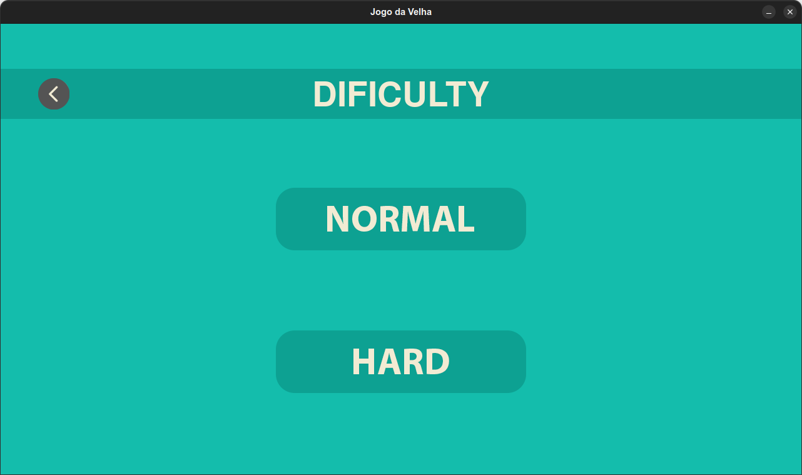
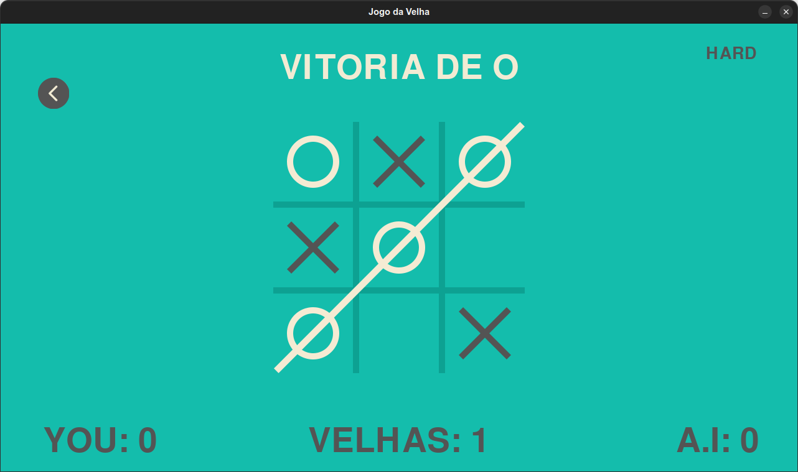
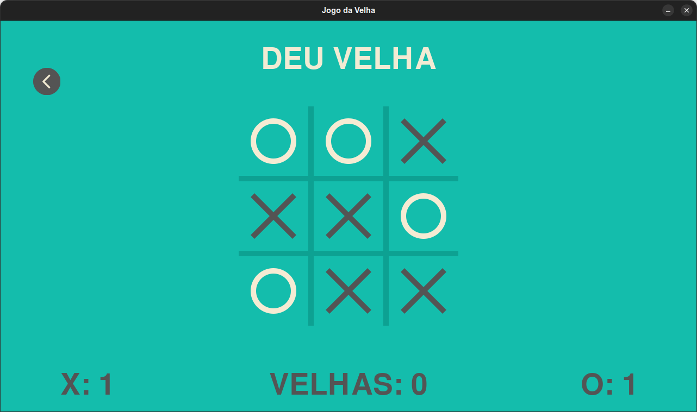
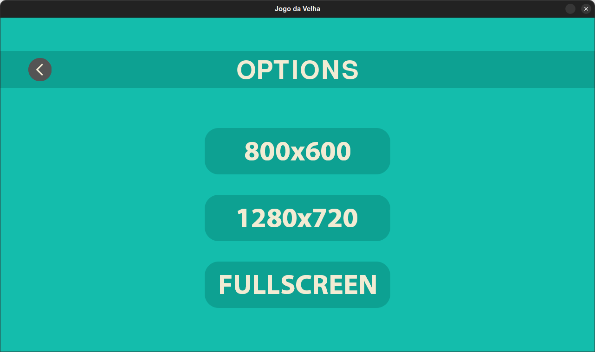

# Jogo da Velha com Pygame e algoritmo Mini-Max
## Introdução
Nesse projeto, desenvolvi um jogo da velha com
interface e implementei um algoritmo Mini-Max em
Python, utilizando somente a biblioteca Pygame.

O objetivo nesse projeto era criar um modo de
jogo que possuísse uma i.a que nunca sofresse uma
derrota e sempre conseguisse vencer quando
possível, além de um nível de dificuldade normal
onde o player quase sempre terá a chance de
vencer o jogo.
>O programa e o código fonte estão em português

## Requisitos
* Ter o Python instalado na versão 3.10.4 (durante o desenvolvimento, utilizei a versão 3.10.4, então não garanto que versões anteriores funcionem);
    * ter as seguintes bibliotecas no Python:
        * pygame==2.1.2
        * pywin32==303 (caso esteja no Windows)
* O modo fullscreen funciona apenas no Windows.
## Como utilizar
### Intalando as bibliotecas necessárias
```bash
$ git clone https://github.com/gbPagano/tic-tac-toe-with-interface
$ cd ./tic-tac-toe-with-interface
```

Caso esteja no Windows:
```bash
$ pip install -r requirements.txt
```
Se não:
```bash
$ pip install pygame==2.1.2
```
### Executando o jogo
```bash
$ python main.py
```
---
É possível jogar o jogo com 2 jogadores ou contra o computador. 

O modo contra o computador possui 2 níveis de dificuldade, no nível de dificuldade normal o player quase sempre terá a chance de vencer o jogo, já no modo hard será impossível vencer a i.a, e ela sempre ganhará quando possível.

Como dito antes, modo fullscreen funciona apenas no Windows, logo cuidado ao navegar pelas opções caso esteja em outro sistema operacional.








